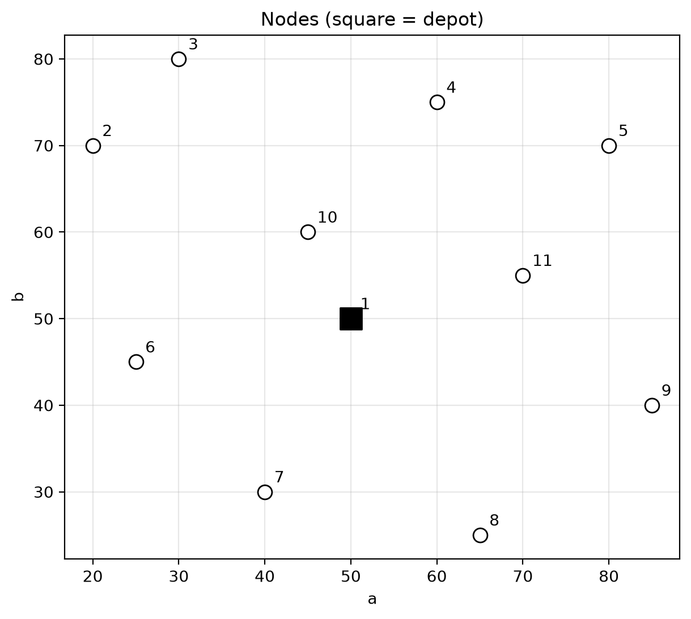
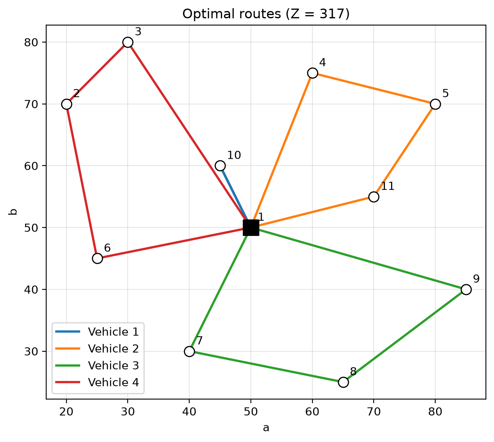

# Capacitated Vehicle Routing Problem

Didactic CVRP instance: 1 depot, 10 customers and
capacity 50 using a Mixed-Integer Linear Programming model solved with PuLP + CBC.

The full explanation of the mathematical model is in [`main.pdf`](main.pdf). The comments in `entregable1.py` reference the same equation numbers.

## Model summary

See `main.pdf` for the detailed derivation. In short:

- **Sets:** nodes `N` (node 1 is the depot), customers `C = N \ {1}`, vehicles `K = {1, 2, 3}`, arcs `A = {(i, j) : i ≠ j}`.
- **Parameters:** rounded Euclidean distance `d_ij` (eq. 1), demand `q_i`, capacity `Q = 50`.
- **Variables:** `x_ijk ∈ {0,1}` (vehicle `k` travels arc `i → j`), `u_i ∈ [0, Q]` (load accumulated on arrival at `i`).
- **Objective (eq. 4):** minimize total distance `Σ_k Σ_(i,j) d_ij · x_ijk`.
- **Constraints:**
  - (5) every customer is visited exactly once;
  - (6) flow conservation per node and vehicle;
  - (7) each vehicle leaves the depot at most once;
  - (8) vehicle capacity;
  - (9) MTZ subtour elimination;
  - (10) lower bounds on accumulated load.

## How to run

```bash
python3 -m venv .venv
source .venv/bin/activate
pip install -r requirements.txt
python entregable1.py
```

The script prints the solution and writes the plots to `img/`.

## Results

```
Status: Optimal
Minimum distance Z = 337.0
Vehicle 1: 1 -> 9 -> 5 -> 4 -> 10 -> 1  (load 49/50)
Vehicle 2: 1 -> 2 -> 3 -> 11 -> 1  (load 47/50)
Vehicle 3: 1 -> 6 -> 7 -> 8 -> 1  (load 50/50)
```

| Nodes | Optimal routes |
|-------|----------------|
|  |  |
